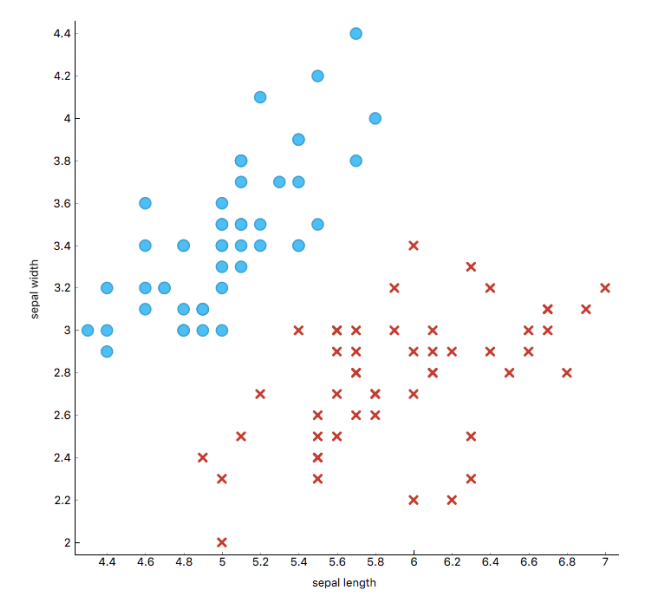
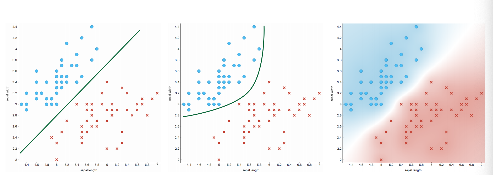
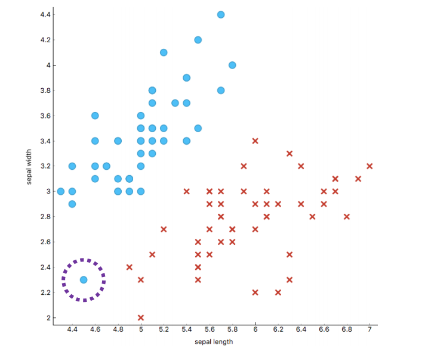
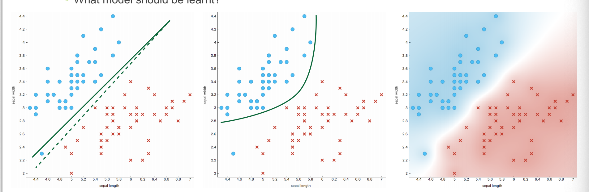

# Foundations of ML

## What is Machine Learning

?> Machine learning is programming computers to optimise the **performance** on a particular **task** by **generalising** from examples of **past experiences** to **predict** what is occur in future experience.

A computer is said to learn

-   Some class of tasks **T**
-   From experience **E**
-   Measured by performance **P**

If its perormance at tasks in **T**, as measured by **P** improves with experience **E**

>   Spam example. Given an email, we detect if the email is spam or not.
>
>   **T:** Decide wether if it's a spam or not
>
>   **P**: Compare with the actual label given.
>
>   **E:** Some experience from the past which email is scam or not

### Task: Unknown Target Function

The task can be expressed as **unknown target function**

$$y = f(x)$$

-   Attributes of the task: \\(x\\)

-   Unknown function: \\(f(x)\\)

-   Output of the function: \\(y\\)

ML finds a Hypothesis, h, which is a function (or model) which approximatees the unknown target function (the function of the line)

$$h(x) \approx f(x)$$

-   The hypothesis is **learnt from experience**
-   A good hypothesis has a **high evaluation from performance measure**
-   The Hypothesis generalises to **predict the output of instances from outside the Experience.**

### Experience

The Experience is denoted D such as

$$ D = \{X, f(X)\}$$

-   Attribute of the task: \\(X\\)
-   Output of the Unknown function: \\(f(X)\\)

### Perfornmance

?> Numerical measure tht determines how well the hypothesis matches the experience.

This is measured against the experience.

## Type of Machine Learning Problems

### Supervised learning

In **supervised learning**, the output is known

$$y = f(x)$$

**Experience**: examples of input-output pairs

**Task**: Learns a model that maps input to desired output. Predict the output for new "unseen" inputs

**Performance**: Error message how closely the hypothesis predicts the target output.

>   Two main types of supervised learning:
>
>   -   Classfication
>   -   Regression

### Unsupervised learning

**In unsupervised learning**, the output is unknown

$$ ? = f(x)$$

**Experience:** Data set with values for some or all attributes

**Task**: 'invent' a suitable output. Identify trends and patterns between data points

**Performance**: How well the "invented" output matches the dataset

### Reinforcement Learning

In **reinforcement learning**, the target function is to learn an optimal policy, which is the best "action" for a **dynamic agent** to perform at any point in time

$$a = \pi * (S)$$

**Experience**: A transition function, the result of performing any action in a state

**Task**: Learn the optimal actions required the agent to achieve a goal

**Performance**: Reward ( or reinforment ) to perform certain action(s).

>   Reinforcement learning shares similarities with supervised and unsupervised learning:
>
>   -   The output (action, \\(a\\)) is unknown, however
>   -   The experience gives an "output" of performing action in states: \\((s, a) \rightarrow s'\\) 
>   -   The performance measures the "worth/reward" of each experience instance: \\(R(s,a)\\)
>   -   The performance acts as a proxy for the "actual" output, since in simple terms, it is the best "reward", that is accumulated over time as the agent conducts actions.

### Other machine learning

-   Semi-supervised
-   Active learning
-   Transfer learning
-   ...

## Hypothesis Space

?> Hypothesis Space is the set of all hypotheses over the state space of a given problem that a given algorithm is capable of learning

### Which hypothesis to learn

Consider:

-   Should the experience be matches
-   Should the performance be maximised
-   What happens if there is noise
-   Which hypothesis should be learnt if multiple hypotheses all have the same performance?
-   Can a good hypothesis be found?

### Ockham's Razor

**Principle**: to prefer the simplest hypothesis that is (reasonably) **consistent with the experience**

?> Choose the first one since it's the simplest.

### What is the best model to be learnt?

The circle dot is the outliner

>   3 has the best accuracy amongst all. 
>
>   But you should....?

### True Hypothesis & True Error

Machinelearning uses experience ( data sets) which are limited sample of the "true" problem, that is, the unknown target function

We really want to know twhat the performance of a ypothesis is against the target function, known as the **true error**

All algorithms for Machine Learning make a significant assumption.

*The experience is a reasonable representation (or reasonable sample of the true but unknown target function)*

### Core challenge

◦ Deciding what data to use 

◦ Deciding if an algorithm is suitable 

◦ Deciding the most suitable performance measure 

◦ Deciding which hypothesis is “the best” to use for a task

 ◦ Making an ultimate judgement of how to approximate the unknown target function

Core challenge is in **analysis** and **evaluation**

