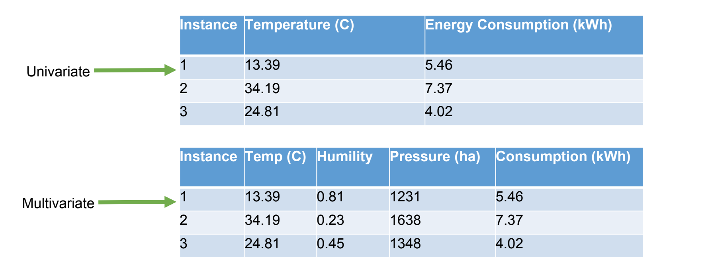
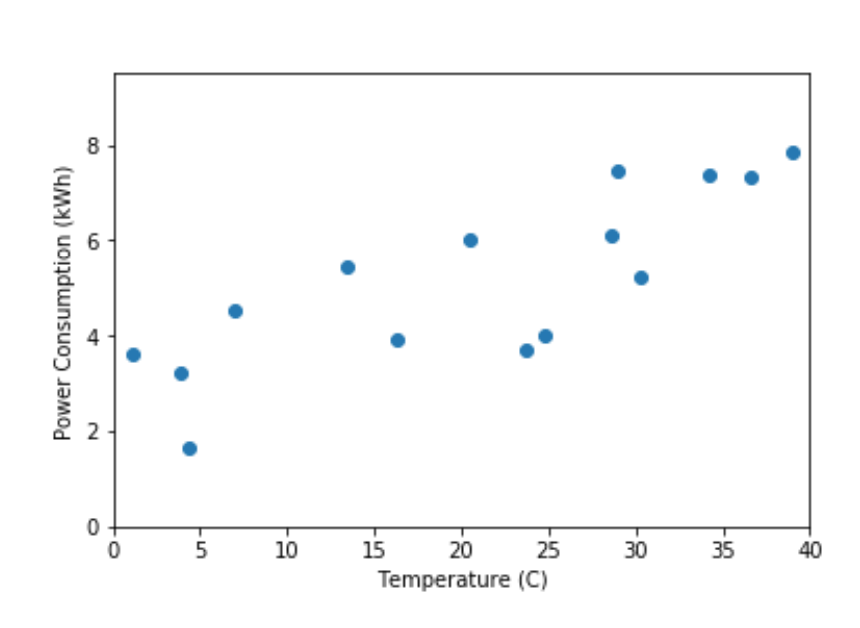
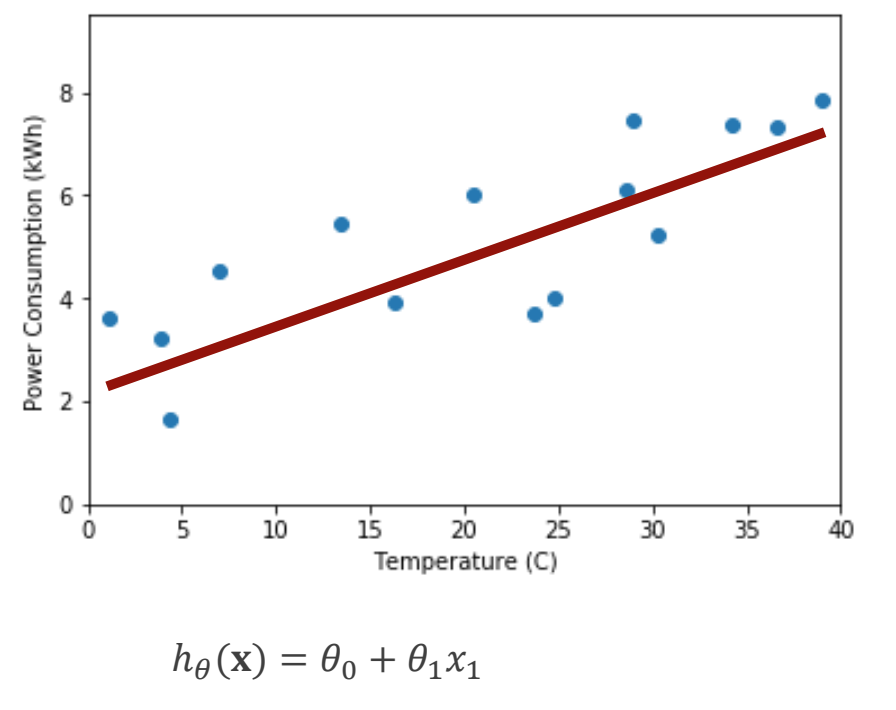

# Week 2: Regression

## Revision

### Task

The Task is an **unknown target function**

$$y = f(x)$$

-   Attributes of the task: \\(x\\)
-   Unkown function: \\(f(x)\\)
-   Output of the function: \\(y\\)

ML finds a Hypothesis, \\(h \in H\\), which is a function approximates the unknown target function

$$h*(x) \approx f(x)$$

The hypothesis is often called a **model**

### Supervised Learning

In supervised learning, the output is known

$$y = f(x)$$

**Experience:** Examples of input-output pairs

**Task**: Learns a model that maps input to desired output Predict the output for new "unseen" inputs.

**Performance**: Measure how closely the hypothesis predicts the target output

Two main types of supervised learning:

-   Classificatisn
-   Regression

### Experience

The **Experience** is a data set, \\(D\\), of values:

$$D = {x^{(i)}, f(x^{(i)})}$$

-   Attributes of the task: \\(x^{(i)}\\)
-   Output of the Unknown function: \\(f(x^{(i)})\\)

The experience is often called the **training data** or **training examples**

### Performance

Is numerical measure that determines how well the hypothesis matches the experience

>[!NOTE]
>Performance is measured against the experience
>**NOT** the unknown target function!

---

# Regression

Regression is a form of supervised learning

$$y = f(x)$$

The output is continuous \\(y \in R\\)

>   Examples:
>
>   -   Stock price prediction - predict google stock prices from google, amazon, Microsoft.
>   -   Predict distance for each pixel of a 2D image
>   -   Predicting hospital length-of-stay at time of admission.

## Experience

The experience is data set (instances) of inputs and outputs

$$D = \{x^{(i)}, f(x^{(i)})\}$$

-   Attribute of the task: \\(x\\)
    -   Real-time, continuous
    -   Independent variables
-   Outputs: y, real-value, continuous
    -   Dependent variables

## Data Representation

>[!NOTE]
>**Univariate**: 1 specific variable quantity
>
>**Multivariate**: Multiple variables

----

## Linear Regression

Hypothesis is linear equation:

$$h_\theta = \theta_0 + \theta_1x_1 + \theta_2x_2 + ... + \theta_nx_n$$

-   Features/attributes: \\(x = [x_1,x_2,...x_n]\\)
-   Weights: \\(\theta = [\theta_0, \theta_1, ... \theta_n]\\)

-   Hypothesis \\(h\\) with respect to weights \\(\theta\\)

## Simple Univariate Linear Regression

$$h_\theta(x) = \theta_0 + \theta_1x_1$$

-   "intercept": \\(\theta_0\\)

-   "gradient": \\(\theta_1\\)

>[!TIP]
>
>**Univariate linear regression** focuses on determining relationship between one independent variable and one dependent variable.
>
> Comes handly mainly in the situation where relationship between two features is not obvious to the naked eyess

# Training Linear Regression

## Goal

The goal is to find the "**best**" regression line.

In order to do that, we:

-   Need a measure of **performance**
-   Minimise the sum of the distance between hypothesis and training exaxmples
-   \\(h_\theta(x) = \theta_0 + \theta_1x_1\\)

## Loss Function

Loss Function is the measure of performance

$$J(\theta_0,\theta_1) = \frac{1}{n}\sum_{i=1}^n(h_\theta(x^{(i)})-y^{(i)})^2$$

Find a hypothesis that minimises the sum of squared differences between the 

-   Predicted output: \\(h_\theta(x^{(i)})\\)
-   Actual output: \\(y^{(i)}\\)
-   For each training example, \\(x^{(i)}, y^{(i)}\\)

>[!NOTE]
>
>Goal: Find \\(\theta_0, \theta_1\\) that minimise \\(J(\theta_0, \theta_1\\)
>
>-   That is, \\(minJ_{\theta_0, \theta_1}(\theta_0, \theta_1)\\)

>   **Aside Notation**
>
>   Summation: \\(\sum_{i=1}^n\\)
>
>   Difference: \\(h_\theta(x_1^{(i)}) - y^{(i)}\\)
>
>   Squared difference: \\((h_\theta(x_1^{(i)}) - y^{(i)}) ^2\\)
>
>   Sum of squared differences: \\(\sum_{i=1}^n(h_\theta(x_1^{(i)}) - y^{(i)}) ^2\\)

### Simplified Loss function intuition

First, consider a simplified version of loss function, forcing \\(\theta_0\\) = 0

-   Thus, the hypothesis is effectively: \\(h_\theta(x) = \theta_1x_1\\)
-   Minimise: \\(J(\theta_1)\\)
    -   That is \\(J(\theta_1) = \frac{1}{n}\sum_{i=1}^n(\theta_1x_1 ^{(i)} - y^{(i)}) ^2\\)
-   Goal: \\(minJ_{\theta_1}(\theta_1)\\)

### Complete loss function intuition

-   Hypothesis: \\(h_{\theta}(x) = \theta_0 + \theta_1x^{(i)}\\)

-   Loss function: \\(J(\theta_0, \theta_1) = \frac{1}{n} \sum_{i=1}^n (h_{\theta}(x^{(i)}) - y^{(i)}) ^2\\)
-   Parameters: \\(\theta_0, \theta_1\\)
-   Goal: \\(minJ_{\theta0,\theta1}(\theta_0, \theta_1)\\)

# Gradient Descent

Recall we want to find minimise the loss function,  \\(minJ_{\theta_1}(\theta_1)\\)

General approach:

-   Start with some \\(\theta_0, \theta_1\\)
    -   Could be random
    -   Could be based on some heuristics or rules or another ML approach
-   Update \\(theta_0, theta_1 such that it reduces J(\theta_0, \theta_1)\\)
    -   Use gradients, that is the derivative of J(\theta_0, \theta_1)
-   Repeat until the minimum is found
    -   Hopefully the global minimum

## Differentiating the Loss function

Require the derivative of the loss function: \\(J(\theta_0,\theta_1) = \frac{1}{n}\sum_{i=1}^n(h_\theta(x^{(i)})-y^{(i)})^2\\)

-   Derivative with respect to that variable(s)?
    -   For minimising loss function, this is the weights
    -   That is \\(\theta_0, \theta_1\\)
-   As the attributes are independent, so are the weights
    -   Can take partial derivatives!

#### Partial derivatives

Partial derivatives of the loss function: \\(J(\theta_0,\theta_1) = \frac{1}{n}\sum_{i=1}^n(h_\theta(x^{(i)})-y^{(i)})^2\\)

### Gradient Descent

Consider \\(\alpha\frac{\delta}{\delta\theta}J(\theta_0, \theta_1)\\)

-   Magnitute (direction): \\(\frac{\delta}{\delta\theta_1}J(\theta_0,\theta_1)\\)
-   Size: \\(\alpha\\) (also called the learning rate), usually non-negative, \\(alpha > 0\\)

Update for \\(\theta_1\\):

 \\(\theta_1 = \theta_1 - \alpha\frac{\delta}{\delta\theta}J(\theta_0, \theta_1)\\)

### Gradient Descent Approach

-   Start with some \\(\theta_0, \theta_1\\)

-   Repeat until covergence (gradients are zero in every direction or little or no change between iterations)

    -    \\(\theta_1 = \theta_1 - \alpha\frac{\delta}{\delta\theta_1}J(\theta_0, \theta_1)\\)

    -    \\(\theta_0 = \theta_0 - \alpha\frac{\delta}{\delta\theta_0}J(\theta_0, \theta_1)\\)

        

