# Week 2: Regression

## Revision

### Task

The Task is an **unknown target function**

$$y = f(x)$$

-   Attributes of the task: $x$
-   Unkown function: $f(x)$
-   Output of the function: $y$

ML finds a Hypothesis, $h \in H$, which is a function approximates the unknown target function

$$h*(x) \approx f(x)$$

The hypothesis is often called a **model**

### Supervised Learning

In supervised learning, the output is known

$$y = f(x)$$

**Experience:** Examples of input-output pairs

**Task**: Learns a model that maps input to desired output Predict the output for new "unseen" inputs.

**Performance**: Measure how closely the hypothesis predicts the target output

Two main types of supervised learning:

-   Classificatisn
-   Regression

### Experience

The **Experience** is a data set, $D$, of values:

$$D = {\{x^{(i)}, f(x^{(i)})}\}$$

-   Attributes of the task: $x^{(i)}$
-   Output of the Unknown function: $f(x^{(i)})$

>   **i ** runs from 1 to n, it's for datapont

The experience is often called the **training data** or **training examples**

### Performance

Is numerical measure that determines how well the hypothesis matches the experience

>[!NOTE]
>Performance is measured against the experience
>**NOT** the unknown target function!

---

# Regression

Regression is a form of supervised learning

$$y = f(x)$$

The output is continuous $y \in R$

>   Examples:
>
>   -   Stock price prediction - predict google stock prices from google, amazon, Microsoft.
>   -   Predict distance for each pixel of a 2D image
>   -   Predicting hospital length-of-stay at time of admission.

Example: Power comsumption

From the temperature, estimate the amount of kWh.

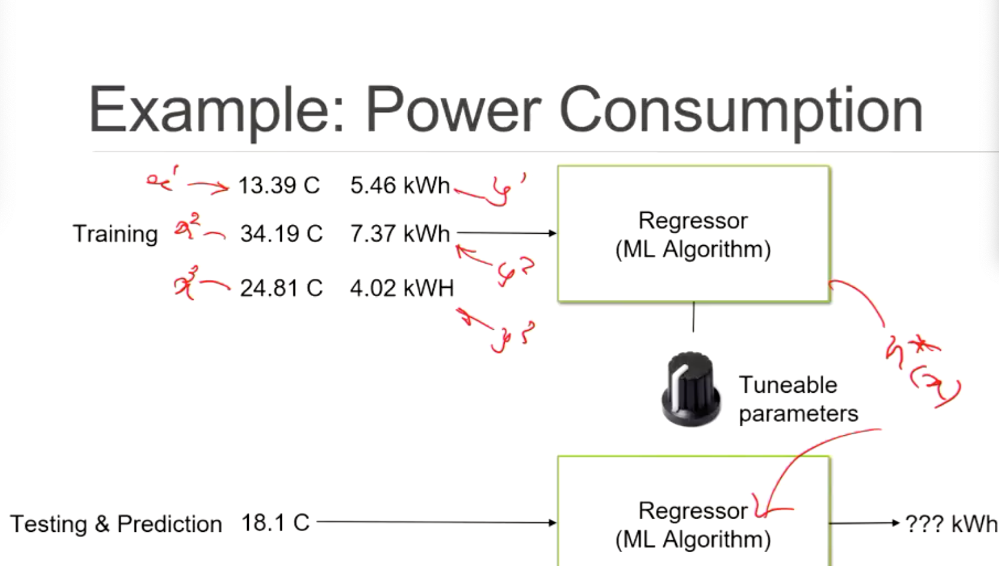

## Experience

The experience is **data set** (instances) of **inputs and outputs**

$$D = \{x^{(i)}, f(x^{(i)})\}$$

-   Attribute of the task: $x$
    -   Real-time, continuous
    -   Independent variables
-   Outputs: y, real-value, continuous
    -   Dependent variables

## Data Representation

>[!NOTE]
>**Univariate**: 1 specific variable quantity
>
>**Multivariate**: Multiple variables, instead of using just temperature, we use more features.

----

## Linear Regression

Hypothesis is linear equation:

$$h_\theta = \theta_0 + \theta_1x_1 + \theta_2x_2 + ... + \theta_nx_n$$

-   Features/attributes: $x = [x_1,x_2,...x_n]$
-   Weights: $\theta = [\theta_0, \theta_1, ... \theta_n]$

-   Hypothesis $h$ with respect to weights $\theta$

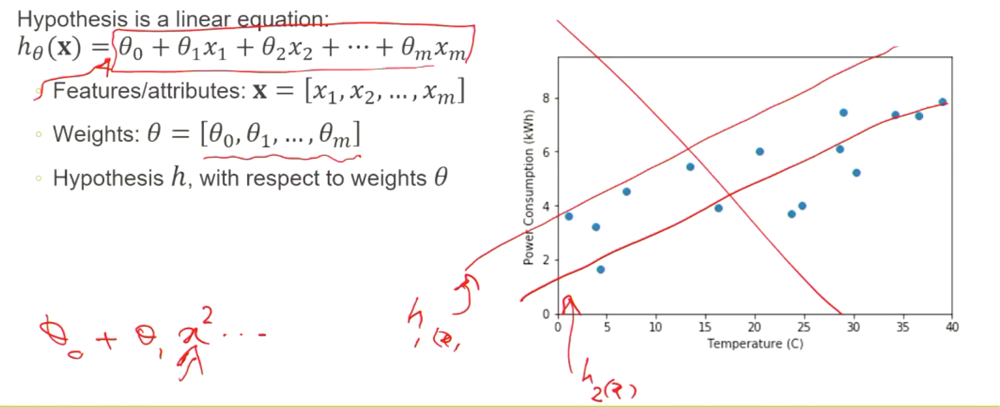

## Simple Univariate Linear Regression

$$h_\theta(x) = \theta_0 + \theta_1x_1$$

-   "intercept": $\theta_0$
-   "gradient": $\theta_1$

>   Instead of a,b we use theta

>[!TIP]
>
>**Univariate linear regression** focuses on determining relationship between one independent variable and one dependent variable.
>
> Comes handly mainly in the situation where relationship between two features is not obvious to the naked eyess

# Training Linear Regression

## Linear Regression Goal

The goal is to find the "**best**" regression line (hypothesis)

In order to do that, we:

-   Need a measure of **performance**
-   Minimise the sum of the distance between hypothesis and training exaxmples
-   $h_\theta(x) = \theta_0 + \theta_1x$

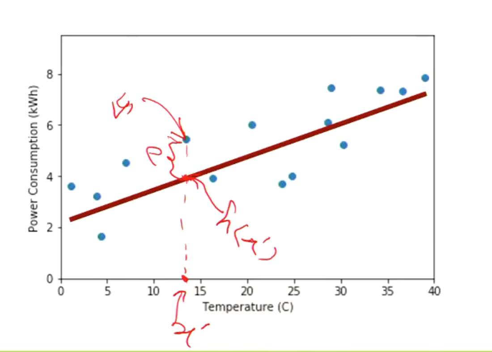

>   We are trying to minimise the distance between $$h(x')$$ and $$y^1$$

## Loss Function

Loss Function is the measure of performance

$$J(\theta_0,\theta_1) = \frac{1}{n}\sum_{i=1}^n(h_\theta(x^{(i)})-y^{(i)})^2$$

>   With **n** is the number of training examples
>
>   $h_\theta(x^{(i)} - y^{(i)})^2$. We need to minimize $J(\theta_0, \theta_1)$

Find a hypothesis that minimises the sum of squared differences between the 

-   Predicted output: $h_\theta(x^{(i)})$
-   Actual output: $y^{(i)}$
-   For each training example, $x^{(i)}, y^{(i)}$ (ith training example)

>   Cost function is to find the best possible straight line
>
>   **Idea**: choose $\theta_0, \theta_1$ so that $h_\theta(x)$ is close to $y$ for our training example $(x,y)$
>
>   => Have to minimize the square difference of $(h_\theta(x) - y)^2$

Cost function will just be the sum of square difference in each line to the hypothesis.

Example:

-   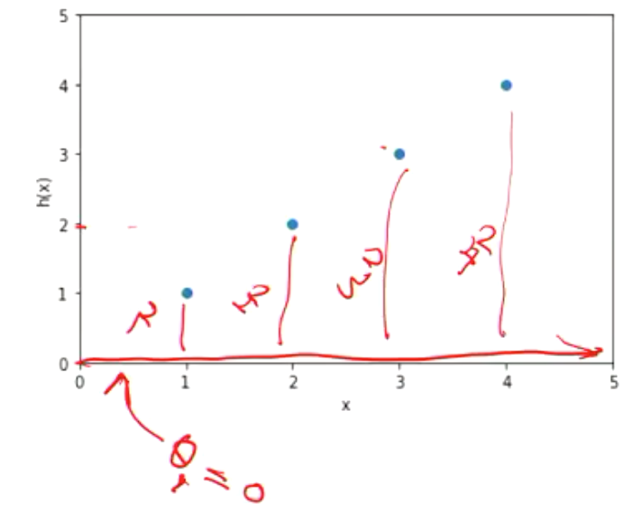

>[!NOTE]
>
>Goal: Find $\theta_0, \theta_1$ that minimise $J(\theta_0, \theta_1$
>
>-   That is, $minJ_{\theta_0, \theta_1}(\theta_0, \theta_1)$

>   **Aside Notation**
>
>   Summation: $\sum_{i=1}^n$
>
>   Difference: $h_\theta(x_1^{(i)}) - y^{(i)}$
>
>   Squared difference: $(h_\theta(x_1^{(i)}) - y^{(i)}) ^2$
>
>   Sum of squared differences: $\sum_{i=1}^n(h_\theta(x_1^{(i)}) - y^{(i)}) ^2$

### Simplified Loss function intuition

First, consider a simplified version of loss function, **forcing $\theta_0$ = 0**

>   Therfore, $h_\theta(x) = \theta_0 + \theta_1x$ = $h_\theta(x) = \theta_1x$. All hypothesis will go through 0.
>
>   Why forcing it to 0 ? Just to make it simpler. 

-   Thus, the hypothesis is effectively: $h_\theta(x) = \theta_1x_1$
-   Minimise: $J(\theta_1)$
    -   That is $J(\theta_1) = \frac{1}{n}\sum_{i=1}^n(\theta_1x_1 ^{(i)} - y^{(i)}) ^2$
-   Goal: $minJ_{\theta_1}(\theta_1)$

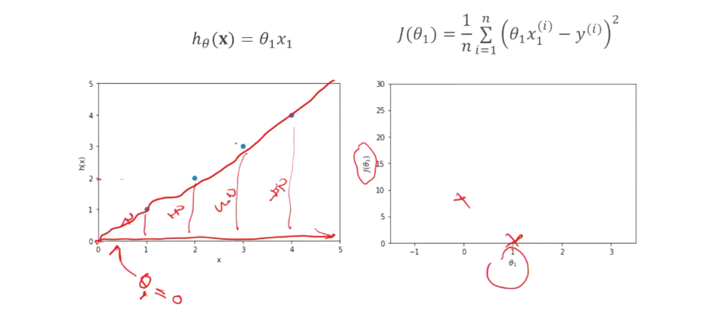

-   On the left we assume $\theta_1 = 0$ therefore our hypothesis is the line y = 0.

at $\theta = 0$, we have the square difference:$1^2 + 2^2 + 3^2 + 4^2 = 10^2$

-   Therefore at $\theta_1 = 0$, $J(\theta_1) = 10$.
-   Now if we choose $\theta_1 = 1$ then, we have the line y = x as the hypothesis. Now the square difference = 0.
-   So, $J(\theta_1) = 0$

### Complete loss function intuition

-   Hypothesis: $h_{\theta}(x) = \theta_0 + \theta_1x^{(i)}$

-   Loss function: $J(\theta_0, \theta_1) = \frac{1}{n} \sum_{i=1}^n (h_{\theta}(x^{(i)}) - y^{(i)}) ^2$
-   Parameters: $\theta_0, \theta_1$
-   Goal: $minJ_{\theta0,\theta1}(\theta_0, \theta_1)$

# Gradient Descent

## Find los function using gradients

Recall we want to find minimise the loss function,  $minJ_{\theta_1}(\theta_1)$

General approach:

-   Start with some $\theta_0, \theta_1$
    -   Could be random
    -   Could be based on some heuristics or rules or another ML approach
-   Update $theta_0, theta_1$ such that it reduces$ J(\theta_0, \theta_1)$
    -   Use gradients, that is the derivative of $$J(\theta_0, \theta_1)$$
-   Repeat until the minimum is found
    -   Hopefully the global minimum

## Differentiating the Loss function

Require the derivative of the loss function: $J(\theta_0,\theta_1) = \frac{1}{n}\sum_{i=1}^n(h_\theta(x^{(i)})-y^{(i)})^2$

-   Derivative with respect to that variable(s)?
    -   For minimising loss function, this is the weights
    -   That is $\theta_0, \theta_1$
-   As the attributes are independent, so are the weights
    -   Can take partial derivatives!

#### Partial derivatives

Partial derivatives of the loss function: $J(\theta_0,\theta_1) = \frac{1}{n}\sum_{i=1}^n(h_\theta(x^{(i)})-y^{(i)})^2$

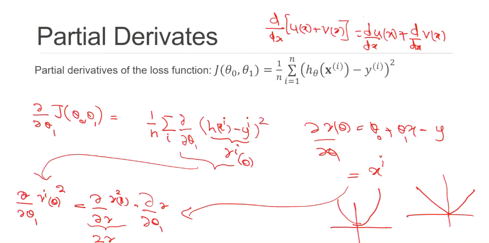

### Gradient Descent

>   Modify the fix learning steps to modify. Because you don't want it to jump too big or too small.
>
>   Gradient Descent will jump big at first, and then jump smaller and smaller
>
>   => Increase in accuracy.

Consider $\alpha\frac{\delta}{\delta\theta}J(\theta_0, \theta_1)$

-   Magnitute (direction): $\frac{\delta}{\delta\theta_1}J(\theta_0,\theta_1)$

>   Derivative of $J(\theta_0, \theta_1)$

-   Size: $\alpha$ (also called the learning rate), usually non-negative, $alpha > 0$

>   $\alpha$ defines how big a step we take.

Update for $\theta_1$:

 $\theta_1 = \theta_1 - \alpha\frac{\delta}{\delta\theta}J(\theta_0, \theta_1)$

### Gradient Descent Approach

-   Start with some $\theta_0, \theta_1$
-   Repeat until covergence (gradients are zero in every direction or little or no change between iterations)
    -    $\theta_1 = \theta_1 - \alpha\frac{\delta}{\delta\theta_1}J(\theta_0, \theta_1)$
    -    $\theta_0 = \theta_0 - \alpha\frac{\delta}{\delta\theta_0}J(\theta_0, \theta_1)$
    -    Stimutaenously update both.

---

# Learning rate

If learning rate $\alpha$ is too small, takes long time to converge

If learning rate $\alpha$ is too large, may overshoot and take long time to coverage, or not even coverage

How to set? Trial and error, prior experience or guidelines

---

# Global vs Local Minima

>   Even with the appropriate learning rate we may not converge to best optimum
>
>   -   This relates to gradient descent in general
>   -   For linear regression, we will find an optimal solution with gradient descent

##  Gradient Descent for Linear Regression

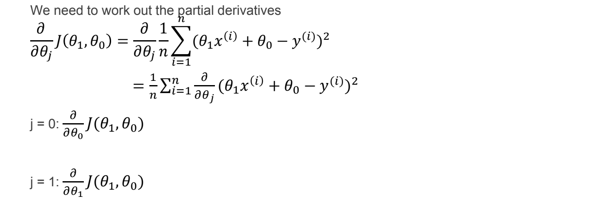

Start with some $\theta_1, \theta_0$

Repeat until convergence (gradients are zero in every direction or little or no change between iterations)

-   $\theta_0 = \theta_0 - \alpha\frac{2}{n}\sum_{i=1}^n(h_\theta(x^{(i)}) - y^{(i)})$
-   $\theta_1 = \theta_1 - \alpha\frac{2}{n}\sum_{i=1}^n(h_\theta(x^{(i)}) - y^{(i)})x^{(i)}$
-   Stimultaneously update both parameters

# Multi-Variate Regression

?> Multiple features / variables

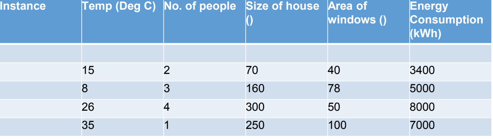

## Multi-variate hypothesis

Single-variate hypothesis: $h_\theta(x) = \theta_0 + \theta_1x_1$

Multi-variate hypothesis: $h_\theta(x) = \theta_0 + \theta_1x_1 + \theta_2x_2 + ... + \theta_mx_m$

-   For $m$ attributes
-   ($n$ is typically used for the size of the data set) 

## Gradient Descent

Hypothesis: $h_\theta = \theta^Tx = \theta_0 + \theta_1x_1 + \theta_2x_2 + ... + \theta_mx_m$

Parameters: $\theta_0, \theta_1, ..., \theta_m$

Loss function: $J(\theta) = \frac{1}{n}\sum_{i=1}^n(h_\theta(x^{(i)} - y^{(i)})^2$

Gradient descent algorithm:

>   `Repeat until convergent(limit){`
>
>   ​	$\theta_j = \theta_j - \alpha\frac{\delta}{\delta\theta_j}J(\theta)$
>
>   `}`

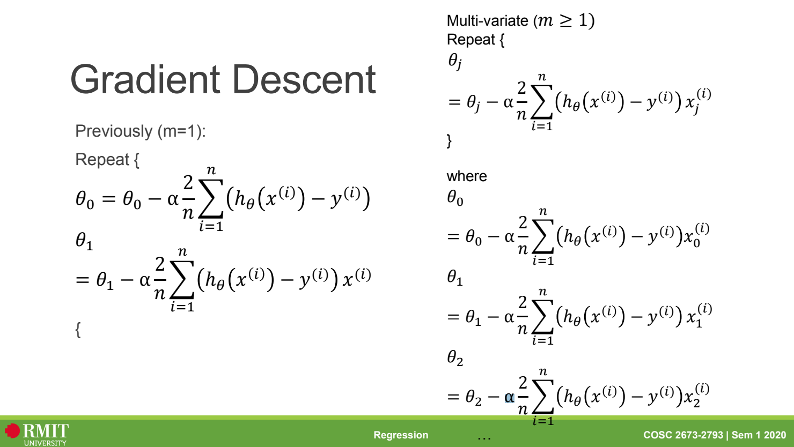

# Issues

### Issues: Hypothesis

We can ask questions about the nature of the hypothesis:

-   Is the regression model (choice of weights) good?

    -   That is, is the hypothesis $h(x)$ a good choice from the Hypothesis Space $H$?

-   Is Linear Regression suitable?

    -   That is, does the hypothesis actually approximate the unknown target function?

        $$h(x) \approx f(x)$$

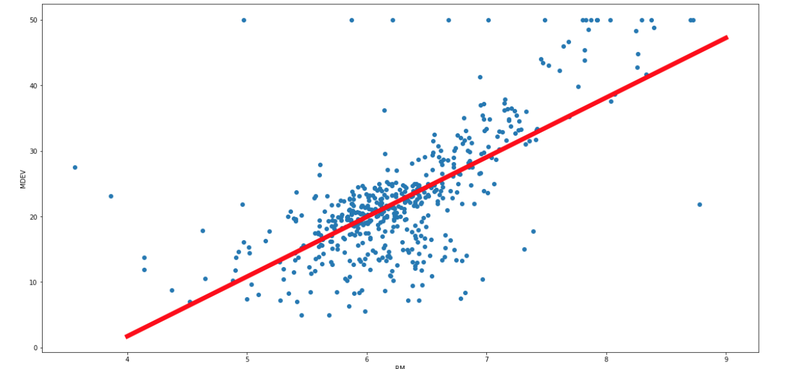

### Issues: Prediction

We can ask questions about what the hypothesis predicts:

-   Is a prediction for an unseen example any good?
    -   How close are $h(x_{unknown})$ and $f(x_{unknown})$

### Issues: Practical Matters

As many ML methods, Linear Regression "works in theory"

-   However there are practical issues such as
    -   Limited computation power
    -   Limited time
    -   Properties (eccentricities) of the data set
-   For regression, feature scaling is one such issue

### Practical Issue: feature scaling

What happens if two features (attributes) have very different domains? 

-   $x_1 =$  temperature (0-40 degree)
-   $x_2 =$ number of people (1-12 people)

Regression works, but slower

-   Prefer to keep **scale** all features to the same proportion
-   Typically use **normalisation**

### Practical Issue: Mean normalisation

Replace each feature $x_i$ with $x_i - \mu_i$ to make features to have approximately zero mean

-   Do not apply to $x_0 = 1$

E.g

-   $x_1 = \frac{temperature-20}{40}$, $-0.5 \le x_1 \le 0.5$
-   $x_2 = \frac{no.of people - 6}{12}$, $-0.5 \le x_2 \le 0.5$

Further adjust by the standard -deviation $x_i = \frac{x_i - \mu_i}{\sigma_i}$

### Practical Issue: Gradient decent

-   Adaptive learning rate
-   Momentum

# Polynomial Regression

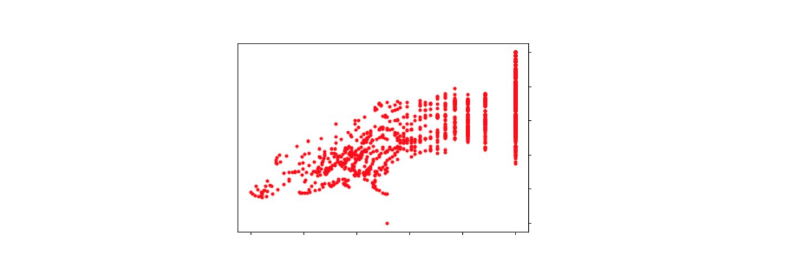

Assumes that the target function (learning task) is a polynomial equation

We have Hypothesis:

-   $h(x) = \theta_0 + \theta_1x_1 + \theta_2x_1^2 + ... + \theta_ix_m + \theta_jx_m^2+...$

## Gradient descent

Loss function is the same: $J(\theta) = \frac{1}{n}\sum_{i=1}^n(h_\theta( x^{(i)}) - y^{(i)}) ^2$

In theory the same gradient descent approach can be use

>   `Repeat until convergent{`
>   ​	$\theta_j = \theta_j - \alpha\frac{\delta}{\delta\theta_j}J(\theta)$
>   `}`

>[!WARNING]
>
>However, feature normalisation becomes very important

# Analytical Regression

## Matrix Form

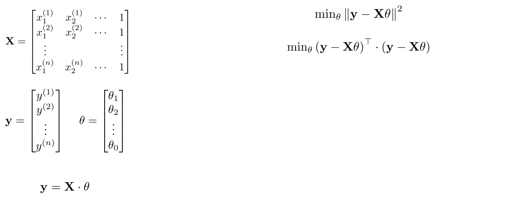

>   Matrix form of loss function to hypothesis line.
>
>   $\theta = (X^TX)^{-1}X^TY$

## Solving for weights

Approximated with the analytical "equivalent" of the gradient descent loss function:

-   Quadratic minimisation problem
-   $min_\theta||y-x\theta||^2$
    -   Find values of $\theta$ which minimises the above

Has unique solution

-   $\theta = (X^TX)^{-1}X^Ty$
-   If the attributes are independent

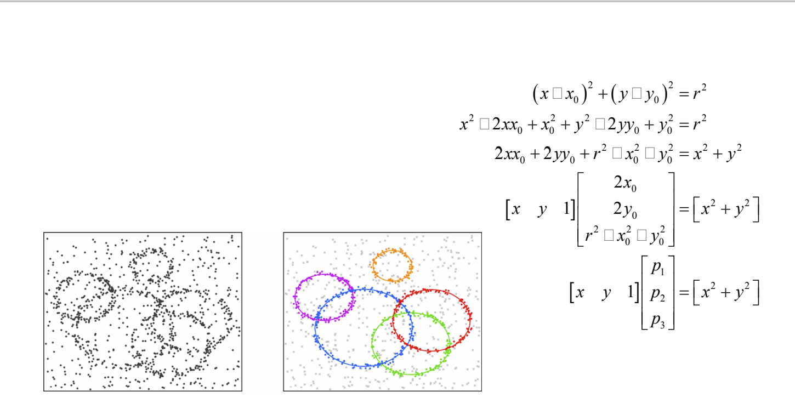

