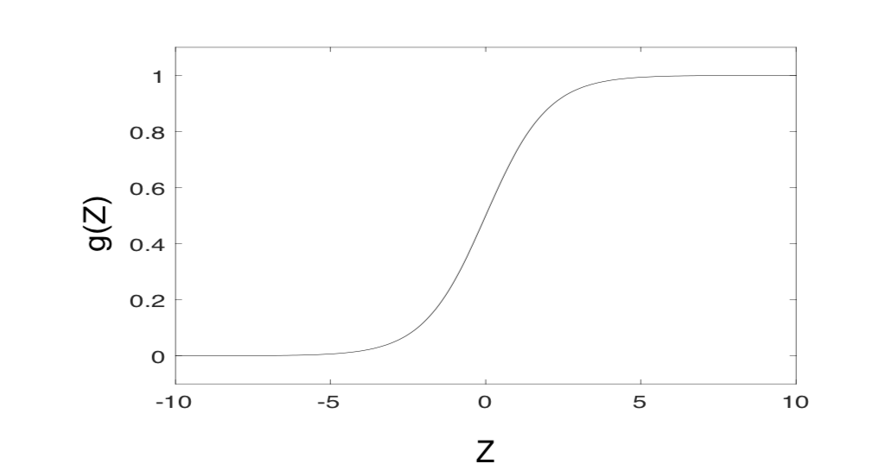

# Logistics regression

## Classification

**Binary**: 0,1, +1, -1

**Tertiary** (or n-ary): 0,1,2,..k or cat,dog,...

### Binary Classification

## Hypothesis Space

### Sigmoid function

?> Also known as **logistic function**

$g(z) = \frac{1}{1+e^{-z}}$

Properties:

-   between 0 and 1
-   continuous and smooth
    -   Can take derivatives
    -   Approximate a step function.

### Logistic Regression Hypothesis

